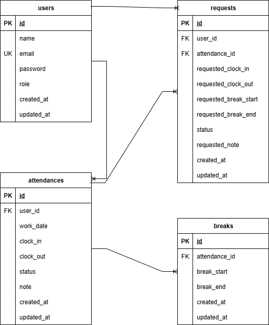

# 勤怠管理アプリ

## 環境構築

### Docker ビルド

１． リポジトリをクローン

```bash
git clone git@github.com:coachtech-material/laravel-docker-template.git
mv laravel-docker-template mockcase2
cd mockcase2
```

２．Docker 起動

```bash
docker-compose up -d --build
```

### Laravel 環境構築

```bash
docker-compose exec php bash
composer install
cp .env.example .env
php artisan key:generate
php artisan migrate
php artisan db:seed
```

## 使用技術

- PHP 7.4.9
- Laravel 8.83.8
- MariaDB 10.3.39
- Nginx 1.21.1
- Docker / Docker Compose

## ER図


## URL

- 開発環境: http://localhost/
- phpMyAdmin: http://localhost:8080/
